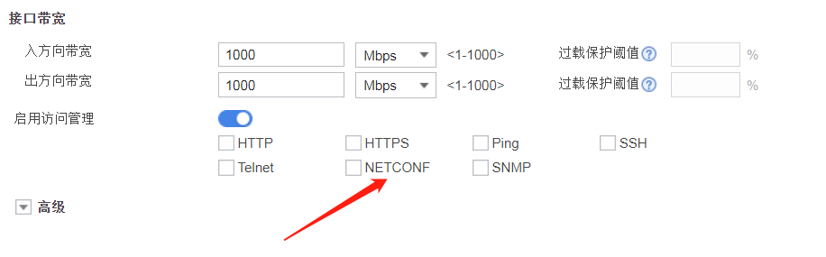
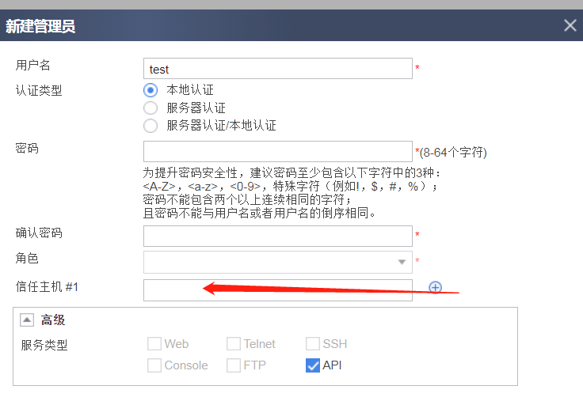
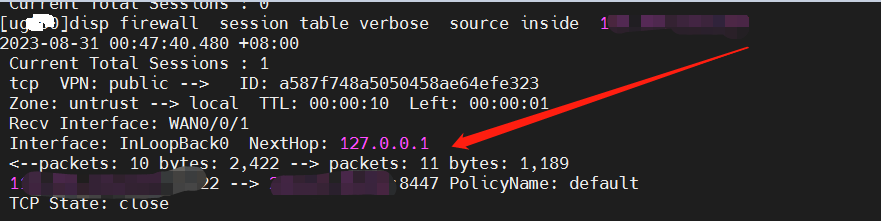

# 华为USG防火墙RESTCONF的坑--终端IP白名单的设置

项目《golang操作华为防火墙ACL实现远程启停》做完后，突然想起RESTCONF接口还没做IP白名单限制呢，会不会所有WAN口的IP都能访问到默认的8447端口？于是找了台云主鸡TELNET测试，果然所有WAN口都能正常访问8447端口。

## 一、临时解决

外网口设置处，看了下访问管理，只有NETCONF可选，没RESTCONF。然后想起之前在帐号管理处有个`受信任主机`设置选项，应该可以设置。果然，经过测试后发现默认没设置白名单时，所有主机都能访问，设置后只有白名单的IP才能通过验证。虽然外网不能登录，但是我感觉这个端口开着总有点不放心，而且我只需要内网访问，能不能对外屏蔽这个API端口呢？

## 二、艰难的尝试

从外网访问某一WAN口，telnet过来，防火墙处disp firewall session看到实际访问的是防火墙本身（local区域）。

于是在安全策略里加上策略A：untrust到local，目的端口为8447，外网测试，仍然能访问，策略命A也没看到命中的记录。甚至我把策略改成从any到local，也不起作用。试了很久都没解决，官方有个对RESTCONF设置安全策略的说明，方法跟我的差不多，但我这里测试不生效，只能暂时用前面的方法了。为什么不能像自身的其他服务（比如http,ssh,telnet)那样可以在指定接口应用呢:cry:.

